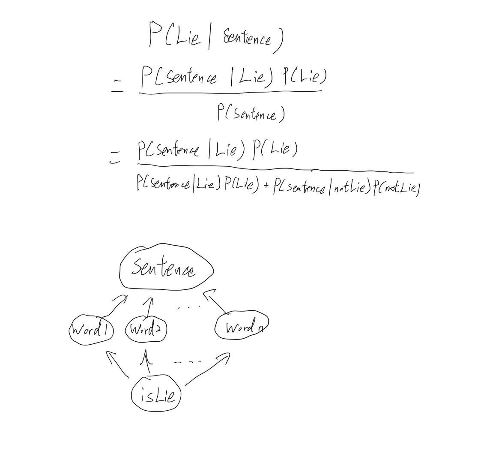

# Lie-Detector-Agent
## Project Abstract Milestone1

## Introduction
This project aims to classify input statements as either truthful or deceptive based on the words presented. Using a dataset from Kaggle [Truth Detection/Deception Detection/Lie Detection.*Dataset* (2022, January 12). Kaggle.] (https://www.kaggle.com/datasets/thesergiu/truth-detectiondeception-detectionlie-detection) that contains labeled political statements (for now, we might change the data set as we later on), we develop a probabilistic agent to determine the likelihood of a statement being a lie. The agent calculates conditional probabilities for words given the truthfulness of statements and applies Bayes' Theorem to determine *P(L|W*)*, the probability of a statement being a lie given its words. Statements with all words unseen from training are flagged as unknown, and returned a failure statement requesting for another input.

---

* **P**erformance measure: what words are in the input statement and what words are in the training data
* **E**nvironment: Only able to see the input statement and the training data.
* **A**ctuators: the input cell and output cell.
* **S**ensors: the input cell.
This is a goal based model, with the only goal to find the probability of lie, and return a output based on that value. This is a memory based model. It needs to look at the training data everytime it makes a decision.

##  Data Exploration and Preprocessing Step

### We are using the dataset politifact_clean_binarized.csv

---

There are 11188 number of observations in this training set. We are going to assume words appear at most once every observation. There are exceptions but due to the set being so large, this error can be neglected. The fist 11087 observations are going to be the training data of this project and the last 100 be the validation set.
The truthfulness of each data, as the owner of this data set states, are evaluated by the Politifact.com team, hence it is realiable.

---

There are 4 columns in politifact.csv: statement, source, link, veracity.

* statement - statement made by celebrity or politician.
* source - can be a person, but not necessarily.
* link - URL of affirmation.
* veracity - degree of truthfulness given by the Politifact.com team.

There are 6305 lies and 4783 truth in total in the training set, which is the first 11087 data in this dataset.

For this dataset specifically,veracity is binarized (into just truths and lies), with 1 being truth and 0 being lie.
For this project, only the first colum and fourth column are needed.
* Parse the training data and extract only the first and fourth columns. The first will be the sentence query and the fourth will be wether is a lie or not.
* **Note:** for this current version, the model does not split the punctuation from the words, for example: "here!" is parsed into one word instead of two. Since we are doing the same for the user inputs, it should be fine.

## Method

#### This project uses **Bayes Network** to calculate P(Lie|Query)
* The variable L∈{0,1} denotes whether a statement is a lie or not. True and mostly true are projected to L=1, while all others (Half-True, Mostly False, False, Pants on Fire!) are all projected as L=0.
* The variable 𝑊𝑖∈{0,1} represents the presence of a specific word in the statement.
* For this model, the conditional probability for a word 𝑊𝑖 given L=*l* is defined as:
* 𝑃(𝑊𝑖=1∣L=l) = # of statements of type containing word 𝑊𝑖 / # of statements of type *l*
* Also, suppose that 𝑃(L=1) = # of lie statements / # of total statements
* Also, suppose that 𝑃(𝑊i=1) = # of statements that contained 𝑊i / # of total statements
* Let 𝑊* be the input statement, and let 𝑊i be the word of the input statement at location *i*.
* For example, if the words 𝑊2 and 𝑊4 are given, then 𝑊*={𝑊2=1,𝑊4=1}.

## Objective
#### Handling unknown words:
For each word within the input statement 𝑊*, check 𝑃(𝑊i). If any 𝑊i has a probability of 0, remove that word from our input string. We will not consider the ones that our agent has never seen before. If all words are invalid, the model returns -1 (unknown). The motivation is that it simplifies the problem by ignoring words that the model hasn’t learned to associate with lies/truths. There are other ways of handling nknown words that may improve the model. These are mentioned in the **Future Feature Expansions** section. There might be statements that have very few valid words, where we might end up with only small propositional of words that we are evaluating on. This means that sentences that have very few valid words will be totally determined by the few words, which will make the model lower its accuracy. More on this in the Conclusions section.
* If all 𝑊i are never trained on, then return an exception statement “Huh, I don’t know about that. Maybe try something more political?”
Given 𝑊*, determine whether the statement is more likely to be a lie or the truth, that is: find 𝑃(L|𝑊*) and compare against threshold 0.5.
* Calculate 𝑃(𝑊i|L) for all words within 𝑊*, 
* Calculate 𝑃(L)
* Calculate 𝑃(𝑊*|L)
* Calculate 𝑃(𝑊*|notL)
* Calculate 𝑃(L|𝑊*) with the above information
* If 𝑃(L|𝑊*) less than 0.5, return “Truth”. Else return “Lie!”

## Step-by-Step Math Calculation

#### 1. Priors: \( P( Lie ) \) and \( P( Not Lie ) \)

- Calculate class probabilities from training data:

  P(Lie) = Number of lies/Total statements
  
  P(Not Lie) = 1 - P(Lie)

#### 2. Likelihoods: \( P( Wi | Lie ) \) and \( P( Wi | Not Lie ) \)

For each word \( Wi \) in the input query:

- **Lie Class**:

  P( Wi | Lie ) = Count of lies containing Wi / Total lies

- **Not Lie Class**:

  P( Wi | Not Lie ) = Count of truths containing Wi / Total truths

#### 3. Joint Probability of Query Given Class

- Assume independence between words:

  P( Query | Lie ) = Product of all Wi over P( Wi | Lie )

  P( Query | Not Lie ) = Product of all Wi over P( Wi | Not Lie )

#### 4. Posterior Probability (Bayes’ Theorem)

P ( Query ) =  P( Query | Lie ) * P( Lie ) + P( Query | Not Lie ) * P( Not Lie )

P(Lie|Query) = P( Query | Lie ) * P( Lie ) / P ( Query )

## Exmaple:
# Example Calculation

From the code’s test case:  
**Query:** `["absolutely", "my"]`  

Assume training data has:  

- Total lies (`numLie`) = 5,000  
- Total truths (`numNotLie`) = 6,188  
- **absolutely** appears in 3,000 lies and 1,000 truths  
- **my** appears in 2,500 lies and 4,000 truths  

## Step 1: Priors  

P(Lie) = 5000 / 11188 = 0.447

P(Not Lie) = 1 - 0.447 = 0.553

## Step 2: Likelihoods  

P( absolutely | Lie ) = 3000 / 5000 = 0.6

P( absolutely | Not Lie) = 1000/6188 = 0.162

P( my | Lie) = 2500 / 5000 = 0.5

P( my | Not Lie) = 4000 / 6188 = 0.646

## Step 3: Joint Probabilities  

P(Query | Lie) = 0.6 * 0.5 = 0.3

P(Query | Not Lie) = 0.162 * 0.646 = 0.105

## Step 4: Posterior  

P(Lie | Query) = 0.3 * 0.447 / (0.3* 0.447 + 0.105 * 0.553) = 0.698

## Future Feature Expansions
For future improvements, the agent will have an additional feature that checks with the user whether the current guess is correct or not. If the user replies no, then the agent will adjust the probabilities by lowering or raising the probabilities of the valid words from the input. That is, change 𝑃(𝑊i|L) for all valid words 𝑊i. If yes, then the agent will do nothing because this means that the current probabilities are good.

## Conclusion
While our model is effective given its simplicity, handling rare words remains a limitation that could impact accuracy, especially on statements with uncommon phrasing. 
The logistic of the main calculate probability function has been tested multiple times, both on small self created data and on the final dataset we are currently using, and also testing using the validation set. The outcome of this function is expected. The outputs from using real data, however, is very interesting. For example, "Donald Trump is the president" is a "Lie", but "Donald Trump is the president of the United States" is "Truth". The accuracy of this agent from testing with the validation set is 58.43%, which is better than baseline but not very high. But it is considered to be hard to identify lies in poltical statements even for a human, political statements are usually always debatable and have some parts of it being correct and other parts being either fake or exaggerated. In addition, political sentences usually requires some background information, such as who is the speaker or when is this sentence being presented, to be able to be identified as a lie or not. 

#### Potential Issues:
* Overfitting to rare words – If a word appears in only one lie or truth statement, the model might assign it an extreme probability (0 or 1), which may not reflect reality.
* Zero-Probability Problem – If a rare word never appears in the training set, it is completely ignored in classification, reducing the model’s robustness.
* Data Sparsity – The model lacks smoothing mechanisms (e.g., Laplace smoothing) to handle infrequent words, meaning it may struggle with unseen or uncommon phrasing.

#### Drawbacks:
* Our current approach removes words with $$P(W_i) = 0$$, which prevents errors but may discard valuable information.
* To improve generalization, we could consider Laplace smoothing or a minimum frequency threshold to balance rare-word impact.
* Future iterations could explore word embeddings or neural models to better capture word semantics beyond raw frequency counts.

Further improvements that can be made to increase the accuracy: One way of doing it is to update the training data as the user enters more inputs, as stated in the Abstract of this project. Another way is to consider the conditional probability of the valid words in the user input, given whether the statements they are in together are lies or not. One of the reasons why the accuracy is not high may be caused by how we handled unknown words. As stated before, there might be statements that have very few words, where we might end up with only small propositional of words that we are evaluating on. One way of fixing this is to check how many valid words there are in the sentence. If there are over half, then continue. If less than half, then return -1 (unknown). This makes sense because this is a memory based model and we do not want to evaluate sentences that contains too many words that the model has never seen before. Another way is adding a new token <UNK>, which represents all the unknown words. But we will need to give this token an initial probability of P( UNK | Lie ). Also, words that rarely appear in the training data are also a risk of low accuracy. We can either count these rare words as unknown words. The upside would be that the accuracy will increase. The downside would be the chance of invalid input will increase (less sentences able to be evaluated).

# Instructions
**To run the agent, download the LieDetector.ipynb file and the politifact_clean_binarized.csv file in the SAME directory. If you are using google collab, you will need to drag the csv file to the "file" location in google collab and overwrite the file location when reading it.**

## Contributors
* Tom Tang
* Guan Huang-Chen
* Xueheng Zhou
* Jefferson Umanzor-Urrutia
* [TheSergiu (dataset owner)](https://www.kaggle.com/thesergiu)
